# METASSAFY
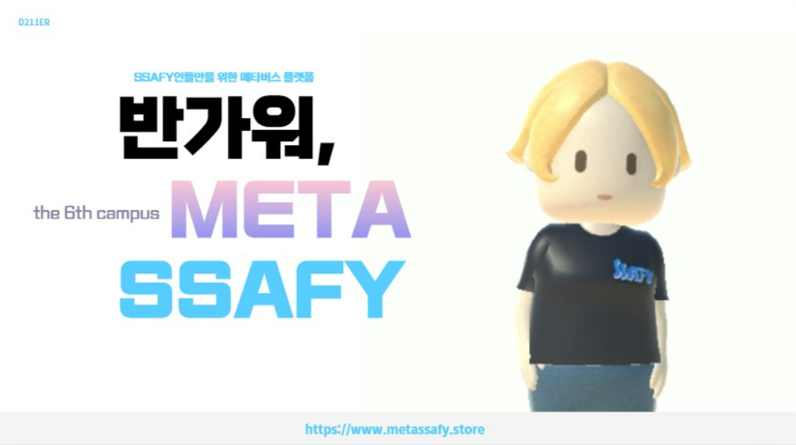
> __D211ER(딜러)팀__  
🍀 오주영 | 💎이시준 | 🌞 이햇살 | 🪑 최지원 | 🎸윤소현 | 🌚 이석원  

> __개발 기간__: 2023.01.03 ~ 2023.02.17 (약 7주) 

#### UCC (이미지 클릭!)

#### 발표자료
[발표자료 링크](/docs/METASSAFY.pdf)

 

#### 기획의도
>싸피 캠퍼스는 총 5개의 지역에 위치하고 있어, 다른 지역의 교육생과는 교류하기 힘듭니다.  
이러한 문제를 해결하기 위하여 싸피의 6번째 가상공간 캠퍼스, 메타싸피를 개발하였습니다.   
단순히 페이지 형태의 SNS가 아니라 메타버스 환경에서 얼굴과 목소리를 들으며 상호작용할 수 있다는 장점이 있습니다.  
다른 캠퍼스의 싸피 교육생과 친해지고 지속적인 교류를 할 수 있습니다.  
한번도 대화해보지않거나 단순히 MM만으로 대화를 나눠본 사람들과 팀빌딩, 스터디 구하기 이제 걱정하지 마세요!  
메타싸피에서는 직접 얼굴도 보고 목소리로 대화를 하며 프로젝트나 스터디에 대해 이야기 할 수 있습니다.  
SSAFY 메타버스 캠퍼스, 커뮤니티 서비스를 기반으로 MetaSSAY가 제 6의 SSAFY 캠퍼스가 되겠습니다.  
 
  

## 기술 스택 & 아키텍쳐
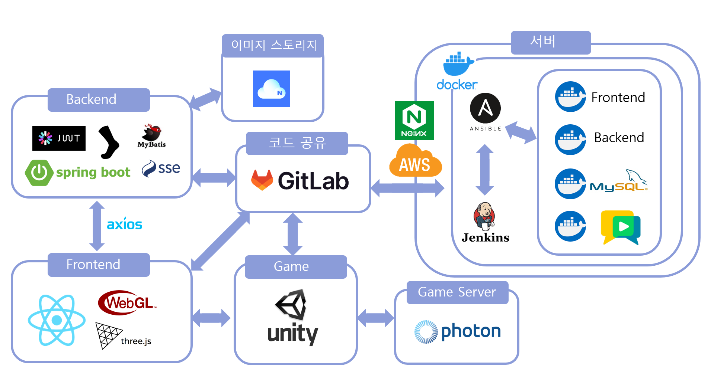
 
 

### Front-End
 `React`
 `Three.js`
 `Cannon.js`
 `Redux`
 `Node.js`
 `Express.js`
 `Socket.IO`
 `Unity3D`
 `Photon`
 `WebRTC`

>##### 메타버스
>- Unity, Photon을 이용한 멀티 플레이 구현
>- Three.js를 이용한 인터렉티브 웹 구현
>- Socket을 이용해 채팅 구현, Sockjs로 서버도 구축

>##### 리액트
>- 컴포넌트 단위로 개발해 협업, 코드 재사용 유리
>- styled-component, mui 등을 사용한 사용자 경험 친화적 UI 구현
>- Redux와 Redux Thunk로 상태 관리

>##### WebRTC
>- OpenVidu를 이용한 화상채팅 구현
  

### Back-end
 `Spring Boot`
 `MyBatis`
 `MySQL`
 `Naver Cloud`
 `JWT`
 `Sockjs`
 `SSE`
>##### 스프링
>- Spring Boot와 MySQL, MyBatis를 사용하여 API를 생성하고 swagger를 사용하여 FrontEnd와 BackEnd의 원활한 협업 진행
>- 이미지 스토리지로 Naver Cloud를 사용하여 BackEnd에서 이미지 저장 처리
>- sockjs, SSE(Server-Sent Events)등을 사용하여 실시간으로 채팅 서비스 구현(안읽은 메세지 수, 안읽은 사람 수 등)
  

### INFRA
 `AWS EC2`
 `Docker`
 `Jenkins`
 `Ansible`
>##### CI/CD
>- Jenkins와 Docker, AWS 이용하여 배포 자동화 구축
>- 메타버스 구축을 위해서 프론트, 백엔드, 소켓을 사용하는 상황이기 때문에 ansible 서버를 사용하여 여러개의 서버를 효율적으로 관리
 
### TEAM Cooperation
 `Jira`
 `Gitlab`
 `Notion`

  
   

## 서비스 소개 
현실의 한계를 벗어난 METASSAFY에서 다른 교육생들을 만나고 다양한 감정을 공유하며 친목을 다질 수 있습니다. 
1. METASSAFY에서 SSAFY 교육과 관련된 사이트 바로 접속
2. 제 6의 SSAFY 캠퍼스에서 다른 친구들을 만날 수 있는 기능
3. 캠퍼스에서 만난 친구를 눌러 프로필 확인(기술스택, 캠퍼스 등의 정보)
4. 친구 신청 및 친구 추가 기능
5. 단체 채팅, 개인 채팅을 통한 상호교류 가능

### 회원 관리
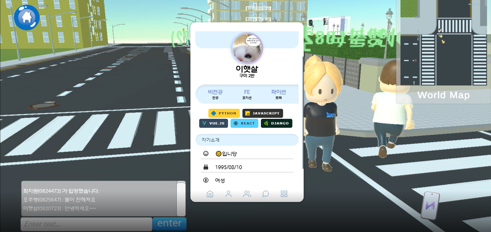

기본적인 회원가입, 로그인, 프로필 수정, 탈퇴가 가능합니다.
- 메타버스라는 공간 속에서 휴대폰을 사용하는 모습을 표현하기 위하여 휴대폰 SNS와 유관한 UI 형태를 사용하게 되었습니다.
- SSAFY 교육생의 학번으로 가입, 이후 SW를 공부하는 학생들 다운 프로필이 될 수 있도록 기술 스택을 저장할 수 있도록 구성하였습니다.

### 싱글 메타버스
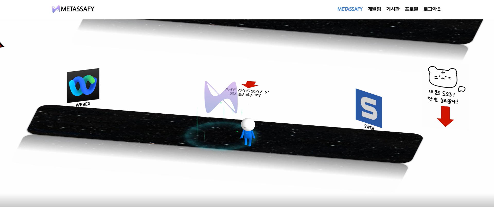

멀티 메타버스 페이지를 비롯한 다양한 페이지로 이동할 수 있는 화면입니다. 
- 사용자가 메타버스 세계 뿐 아니라 개발과 관련된 다양한 사이트로 재미있는 경험과 함께 이동할 수 있도록 배치하였습니다.
- 온라인 멀티 플레이를 시작하기 전 사용자 1인의 공간으로서 메타버스 세계를 가볍게 맛볼 수 있습니다.

### 멀티 메타버스
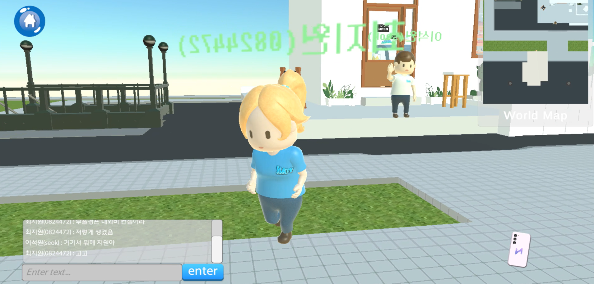
유니티를 통해 제작한 멀티 플레이가 가능한 메타버스입니다.  

- 채팅, 춤, 감정표현 등이 가능합니다.
- 메타버스 내 오브젝트를 클릭하여 핸드폰 페이지, 화상 채팅 페이지, 게시판 페이지 등을 모달로 띄울 수 있습니다.
- 광장에 있는 여러 캠퍼스를 클릭하면 맵이 해당 캠퍼스로 이동합니다. 
- 게임의 형식을 사용하여 흥미도와 참여도를 높였습니다.

### 화상채팅
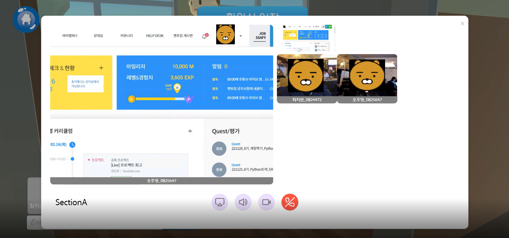
회의실에 입장하여 화상채팅을 할 수 있습니다.
  

- 화면 공유, 카메라 공유가 가능합니다.
- 음성 채팅과 영상 공유를 통해 비대면 화상 회의가 가능합니다.

### 친구 관리
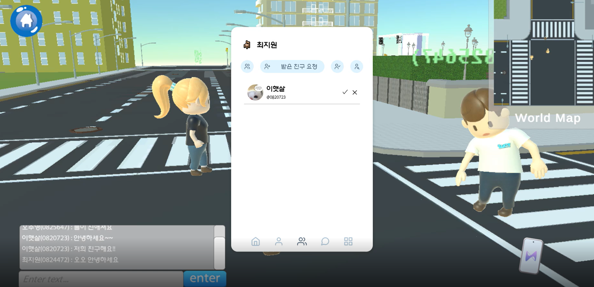
친구 신청, 친구 신청 수락/거절, 친구 목록 보기, 친구 삭제 등
친구와 관련된 기능을 제공합니다.

- 학번과 이름을 통해 다른 지역 캠퍼스의 사람들과도 쉽게 교류할 수 있습니다.
- 친구가 되기 전 상대의 프로필을 통해 상대가 공개한 정보를 확인할 수 있습니다.

### 채팅
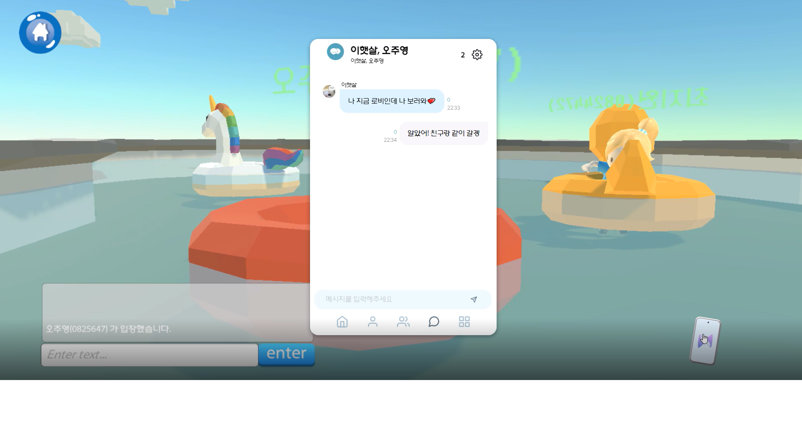
원하는 사람들과 채팅방을 만들어 이야기를 나눌 수 있습니다.

- 개인간의 채팅 혹은 단체채팅이 가능합니다.
- 채팅방의 정보를 수정하거나 나갈 수 있습니다.
- 현재 채팅을 확인하지 않은 인원을 확인할 수 있습니다.

### 게시판
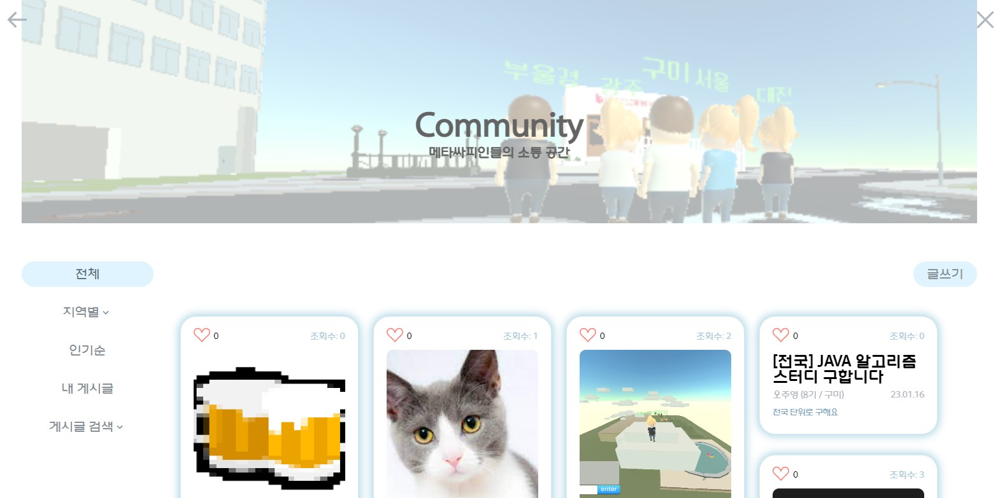
게시판에 글을 쓸 수 있습니다. 
수정, 삭제, 댓글, 대댓글, 좋아요 등이 가능합니다.

- 글 쓴 사람의 정보를 확인할 수 있습니다.
- 게시글의 조회 방식을 필터 기능을 통해 자유롭게 설정할 수 있습니다.
- 다른 지역 사람들의 게시글 또한 확인할 수 있어 지역간의 소통을 원활히 하는 역할을 합니다.
  
  

## 와이어프레임
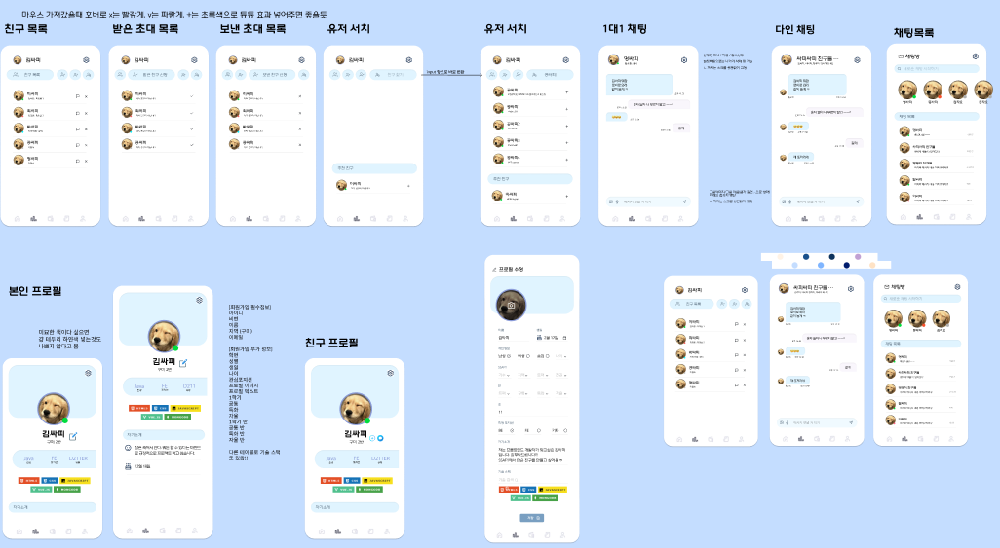
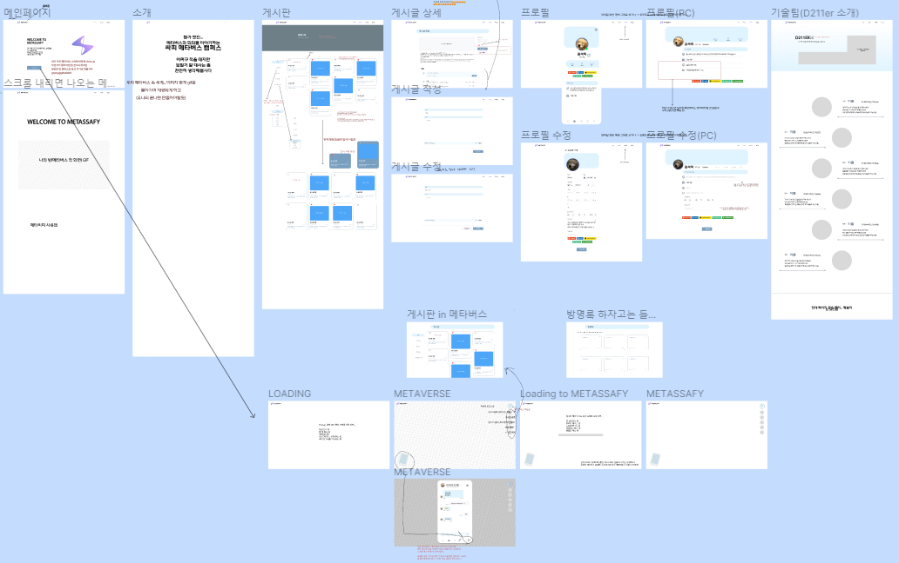
  
  

## 팀원 역할   
| 이름   | 역할 | 내용                        |
| ------ | ---- | --------------------------- |
| 🍀 오주영 | 팀장 | 풀스택 개발, UI/UX디자인, 발표|
| 💎 이시준 | 팀원 | 풀스택 개발,  UI/UX디자인, UCC제작 |                    
| 🌞 이햇살 | 팀원 | 프론트엔드 개발, 유니티 개발|
| 🪑 최지원 | 팀원 | 백엔드 개발, 유니티 개발, 인프라 구축|
| 🎸 윤소현 | 팀원 | 프론트엔드 개발, UI/UX디자인|
| 🌚 이석원 | 팀원 | 백앤드 개발, 유니티 개발, 인프라 구축|

  
  